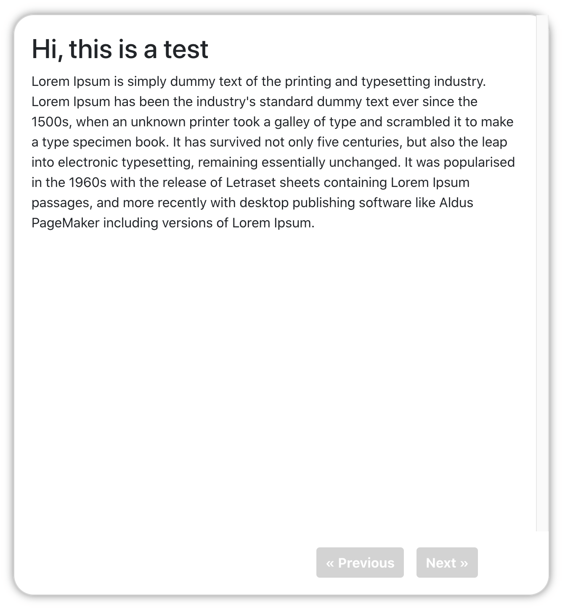
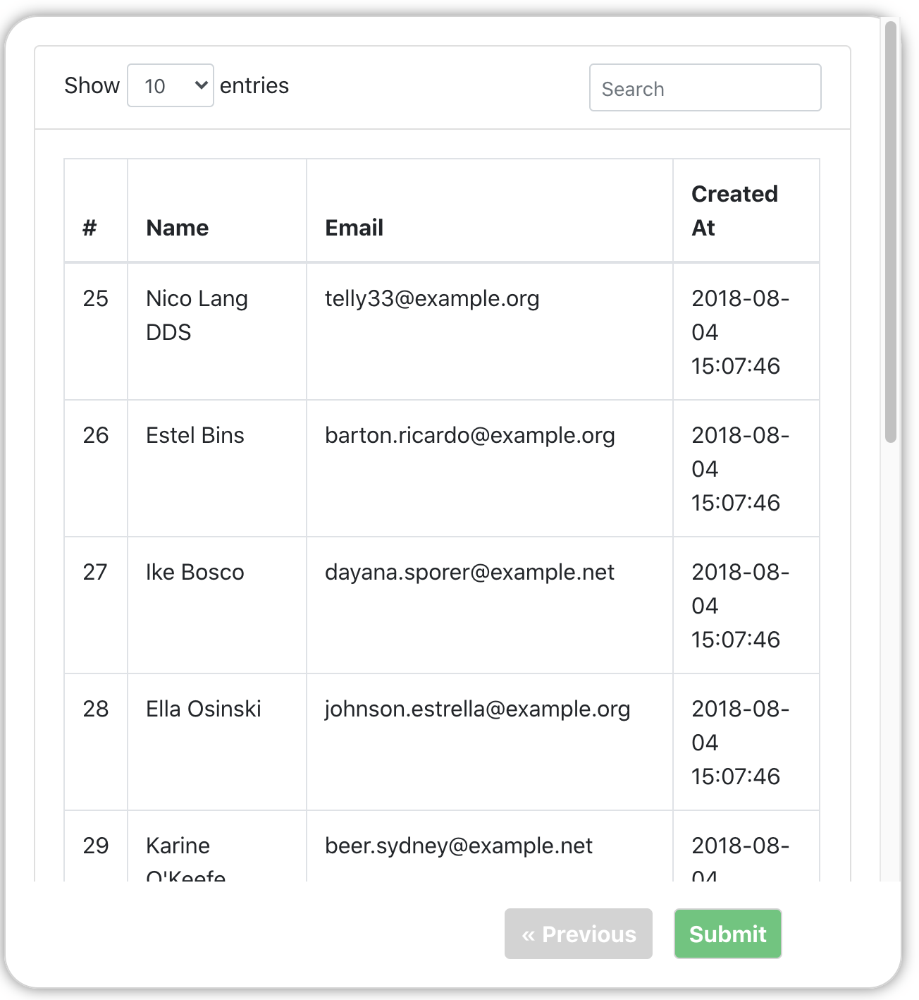

# next-prev-page
A react component designed to create a next-preview-submit page in which we have different components as arguments.

## Installation  
```  
npm install next-prev-page  
```  
### components

 - NextPrevPage 
 
 ## Preview
 




## Features
 - Customize container layout on which each page component is displayed
 - Responsive layout


## Documentation:  
### Example
```javascript

function submitButton() {
  console.log("I've reached the end of the NextPrevPage component!")
}

let pages = [<Page1/>, <Page2/>, <Page3/>];

return (  
    <NextPrevPage 
        pages={pages} 
        submitOnClick={submitButton}
    /> 
);
```
### Props
 - **pages** (required, array): a list of components which will be displayed in the body of the NextPrevPage in the given order 
 - **submitOnClick** (required, function): takes as value a function reference which will be bounded to the submit button displayed on the last page

### Css Classes
The component based on `card` bootstrap component.

 - `container-next-prev`: root class of component.
 - `container-body`: contains the given page.
 - `container-buttons`: contains customized "Next", "Previous", "Submit" buttons.
 - `subbmit-button`: cutomization for "Submit" button. 
